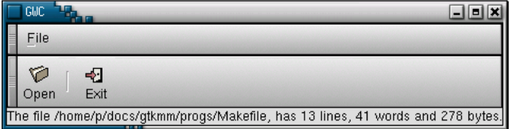
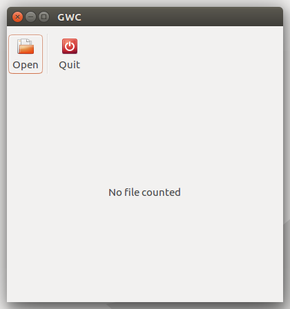
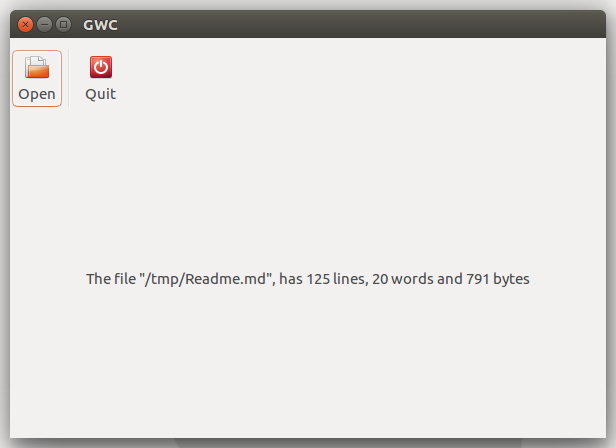

# Introduction

This is a Rust port of the demo application I have written in C++ for an
[article](http://www.drdobbs.com/programming-in-gnome-with-c/184401522?pgno=7)
printed on the 2002's May issue of C/C++ Users Journal, about
introduction to programming Gnomemm applications.

The purpose was to get a grasp of how does it feel to use Rust for writting
Gtk+ applications, specially given that GNOME team seems to be exploring the idea
to adopt Rust to the set of main supported languages. 

# Overview

The screenshot below shows how the old demo application used to look like, back in the
GNOME 1.x days.

## Starting the application

Now the application looks like the screenshot below thanks to Gtk-rs and Gtk+ 3.0.

## Displaying the results

After processing the given file, the results get presented in a similar way like on the old version.

# Compiling

The application was developed with Rust 1.18, maybe it can be compiled with older
versions, but I haven't tested.

To compile just use *cargo* as usual.

# Documentation generation

Given that cargo doesn't have an easy way to generate documentation for all types,
including the private ones, the shell script *gen-docs.sh* takes care of it.

# Acknowledgements

Thanks to cmars (Casey Marshall) for his suggestion how to improve IO error handling.